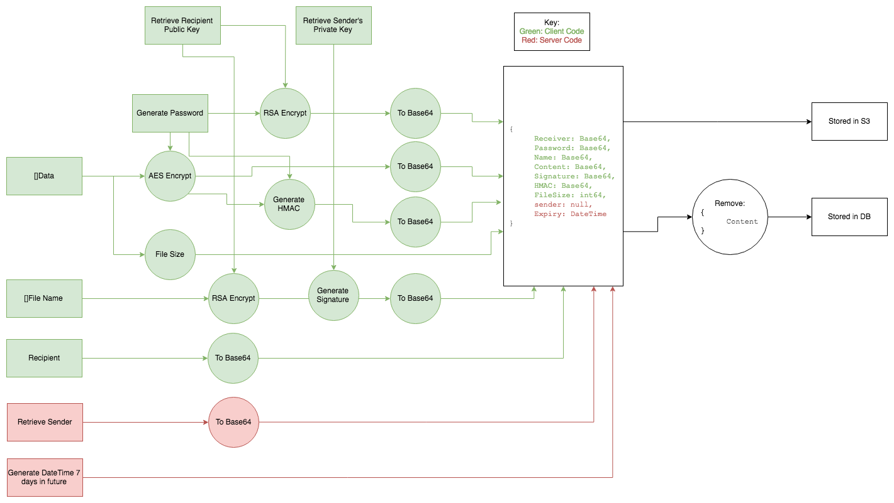

# Wingit

[WingIt](https://app-wingit.herokuapp.com/)

### Installing

(note binaries only available for OSX at the moment)

- Download the .dmg file from [the releases page](https://github.com/amlwwalker/wingit/releases/tag/0.8)
- Run it once downloaded
- Drag Wingit to your Applications folder
- The first time you run it, you will need to allow it to be installed as its not signed by Apple
- Notice in the taskbar the Wingit Icon appears
- Pin to the dock for easy access

### Why

I built Wingit about a year ago for a few reasons.

- I came across very few options for people to share files and knowingly have full end to end encryption available out of the box. Be cool to have true security and not have to do much to get it.
- I wanted it to be as easy as it could be, no setting passwords, no understanding even what encryption really is or how it works, but to know that it is happening.
- I wanted to utilise the work I had done with Go and QML across platforms
- I wanted to build a project that (hopefully) a community can help me build and make as good as possible

Since Mozilla has recently released their file sharing app, I thought I would get this out there. I don't have the might of Mozilla behind me, but hey... why should that stop me.

I cannot be responsible, if you use this to encrypt and send something that is then hacked. I just do not have the resource to offer such guarantees.

If you are interested in encryption, then this project may be of interest to you.

### Status (Resource)

- Please be aware I am doing this myself, I don't have financial resource to put behind this but I will support it as long as I can afford it
- The product is very much in beta. I have released it to find out if there is interest in it. I will not respond to trolls. I am not making money from this. If this doesn't fit your needs, or meet your expectations then you have two options; go and find an alternative, or help me improve it.

### Status (Technical)

- I have yet to write tests for all the code. The intent was to make sure it works from a PoC perspective. I know this isn't TDD but try doing TDD on a pet project while keeping down a day job, and actually making progress... Tests will come. Have patience.
- Currently the application is working as I would want it to. It could do with a lot of UX, I know that but it works and I'm pleased with that.

### Capabilities

- I develop on Mac, so although the goal of this is totally cross platform, it takes time to make sure everything is working on all platforms, hence why I have released a build for OSX and will be releasing one for Windows soon, but the others will take me some time, however I plan to release for Android/iOS and Linux shortly (if I see interest - and will work towards the ones that are a most sort after, and b easier first.

### Usage

#### Sending

- If you are wanting to try it, thats pretty straight forward! Go to app.getwingit.com. Choose the download option you want/are interested in. You will be redirected to a google OAuth. At this stage I have only configured Google OAuth, but with time will add others. I am unlikely to add a classic username/password, because that goes against my goal of passwordless end to end encryption, although depending on what happens community wise, perhaps this will change.
- Once you have registered you will receive an API key. You can log in any number of times to receive this API key.
- Click again on the download option you want. Not all will be available yet remember. This will begin the download
- Install it (Drag to Applications or whatever) and open it.
- Enter your API key
- Search for new contacts using the app. They will also have needed to register at this stage, and will have needed to download and run the application once, for you to be able to send them files.
- Once you have added them, they will appear in your contacts list. You can drag files onto them, or click on the "Upload" arrow by their name to choose a file to send.

#### Receiving

- When someone has sent you a file, you can refresh the list and see new files against contacts for you.
- Be aware that there is currently no restricting people from sending you files without your consent. You can delete files however instead of downloading. In the future I will add permissions on sending.
- Click on a contact who has sent you a file, you can see your files from them.
- Click on a file to download it.
- Files are downlaoded to your user area, and on download the file will open, or you can go to the menu and see files you have received, and click on them there to view them in your default viewer.

### Server

- I have put together quite a simple server to handle the file sharing. Note that all encryption/decryption occurs on your device so what my server sees is just gobbledygook. I and no one else can read it unless they have your computer/device.
- The server stores the files on AWS/S3, currently indefininatly, but very soon I will be adding a 24 hour self destruct once a file has been downloaded. (I have no interest in storing all your encrypted bits and bytes, totally useless to me...)

### Development

- If you would like to help develop the application, then I suggest starting [with this repository](https://github.com/amlwwalker/got-qt). I put this together as a set of instructions on getting started building desktop/native apps using Go and QML. Once you can get that running you are ready to help develop this application.
- Although I will work to keep code clean, as I say, the goal is to get it working and see if there is a community of interest. If there is, then clean code will become more and more of a priority (beyond it being clean enough for me to read). Documentation would come as part of this too. I say all this, however its not very complex, so it shouldn't be too hard to get your teeth into if you have experience with Go or QML. I'm here to answer questions aswell.

### COMPILATION

#### (Builds the native application tested on windows and Mac)

- `export QT_DIR=/usr/local/opt/qt`
- `export CGO_LDFLAGS_ALLOW="-Wl,-rpath,@executable_path/Frameworks"`
- `cd _guiinterface`
- `qtdeploy build desktop`
- Will compile to `./deploy/\$OS/`

### Application

- Most of my efforts have gone towards it working on Mac, however I have trialled it on Windows and Android
- OSX has a logo and a dmg installer ready
- Windows it compiles however it looks quite different (qml UI libraries missing I think, but it still works)
- Android works, however it needs a file explorer (there is no native one I can work out) to choose files to share, however you can receive files
- I reckon Linux will be quite straight forward, I just need to setup a VM to test and tweak it
- Haven't gone near iOS yet, as I'm not familiar with the build routine for creating apps, but I do know getting it on the app store isn't free, so haven't looked into it. If I am to do it, it will be the last platform I support.

- Note each device will generate its own encryption keys so currently will only work on one device (whichever you configure for a user first). I have a plan to add it so files are encrypted for multiple devices, but at the moment this doesn't exist as a feature.

### File Structure

- As compiling with the UI takes a long time, application has two available UIs; Native (QML) and a Console (bash) app
- The console UI is very simple, and does not have complete functionality however it is a useful environment to test and develop flow. I tend to use the console UI for my development to speed things up. Once you have backend functionality working, then add the QML and link it together.
- If you follow the work at [github.com/amlwwalker/got-qt](this repository), then you can use the built in hotloader to develop QML on the fly. In production I then turn the hotloader off and compile the QML code.

### Environment Variables

- The server handles most of the environment variables so you should be able to interact directly with that.

### Hotloader

- If the hotloader is enabled then you have to run the app from the terminal as it needs a relative path
- I have put a config file in `configfiles/config.json` that has a `hotload:false` in it. This config file is certainly a WIP at the moment, but im using `packr` to 'pack' this into the binary. So if you change the value in here, you will need to re pack the file (just type `packr` from next to the main.go file in `_guiinterface/`).
- Please note there are fields in this config file that are not being used, infact only `hotload` is being used at the moment, but in the future others may be used here.
- You can of course just enable/disable the hotloader in main.go if you want, but remember to change it before making a pull request.

### QML

- There is a `loader.qml` and a `loader-production.qml` file at the moment, although in the future this could become one file. The reason I have two is because of loading assets (images etc) in compiled mode requires slightly different paths when compiled and when hotloaded.

### Flow

Below is the flow diagram on how files are encrypted and sent to the server. The data is read in from the file locally as a `[]byte` array. The filename is converted into a `[]byte` array for encryption before storage

### Support

- Add issues to github or contact me via twitter/linkedIn etc if you have questions or interest

# TODO

(possibly out of date - paths)

- [] Function that checks all downloaded public-keys and refreshes them (rather than retrieving ALL keys).
- [] Change MD5 Hash to SHA Hash for RSA-OAEP Encryption/Decryption - `crypto/rsa.go`
- [] Error messages...
- [] HMAC is playing up, haven't looked into this yet. Doesn't affect functionality, just check is failing so no assurance that the sender has seen the content
- [-] With no internet connection, currently crashes if can't upload, suspect same on download? Need timeout
- [-] Still not changing pages correctly, esp around the account and about pages which seem to stop Contacts being able to 're show' itself. I suspect I have lost the edit where if its the current page, don't do anything - check for that and remove it
- [] When user doesn't exist on server can still login locally if old files locally

## Functionality

### GENERAL

- [x] Handler function for file-encryption and uploading. - `handlers/encrypt.go`
- [x] Handler function for downloading and file-decryption - **NOT TESTED** - `handlers/decrypt.go`

### USER

- [x] Google Auth
- [x] API Key
- [] User have multiple keys (one per device) that the file can be encrypted with so they can receive anywhere

### DIRECTORIES

- [x] Create directory locally - `utils/directory.go`
- [x] Remove directory locally - `utils/directory.go`

### FILES

- [x] Load a file locally - `utils/file.go`
- [x] Store a file locally - `utils/file.go`

### SERVER

- [x] Allow for making GET request - `server/connection.go`
- [x] Allow for making POST request - `server/connection.go`
- [x] Download a list of all files shared with the user - `server/file.go`
- [x] Search for a users keys. Search by Email. - `server/key.go`
- [x] Download a specific user's public-key - `server/key.go`/`crypto/keys.go`
- [x] Upload your own public-key - `server/key.go`/`crypto/keys.go`
- [x] Upload an encrypted file with filename (enc), password (enc), signature, HMAC and userId to share with
- [] Download a specific file with encrypted name/key - `server/file.go`

### CRYPTO & KEYS

- [x] Optional crypto verbosity - `crypto/init.go`
- [x] Generate a password - `crypto/password.go`
- [x] Encrypt a file using AES - `crypto/file.go`
- [x] Decrypt a file using AES - `crypto/file.go`
- [x] Generate a new key-pair - `crypto/rsa.go`
- [x] Store a key-pair locally - `crypto/keys.go`
- [x] Load existing key-pair - `crypto/keys.go`
- [x] Load a public key - `crypto/key.go`
- [x] Load a specific users public key. - `crypto/keys.go`
- [x] Encrypt a filename (string) using AES - `crypto/aes.go`
- [x] Decrypt a password using RSA - `crypto/rsa.go`
- [x] Encode an encrypted password/filename using Base64 - `utils/base64.go`
- [x] Test RSA Encryption using function - `crypto/rsa.go`
- [x] Sign bytes with your private-key - `crypto/rsa.go`
- [x] Validate a signature using a public-key - `crypto/rsa.go`
- [] HMAC on encrypted files - `crypto/hash.go` (we use Encrypt-then-MAC, [this stackoverflow thread](see http://crypto.stackexchange.com/questions/202/should-we-mac-then-encrypt-or-encrypt-then-mac) for details) - currently slightly broken (the HMAC verification part anyway...i.e not verifying correctly)
- [] Reload keys of contacts on start and on refresh of contacts
- [] Allow for sync-storage of the generated public-key file (i.e if no connection). - `handlers/sync.go`/`utils/sync.go`

### LOCAL STORAGE & SYNC.

- [x] Store temp. file for encrypted files. - `handlers/store.go`
- [x] Allow for syncing locally stored encrypted files - `handlers/sync.go`
- [x] Allow for a sync. functions to synchronize all temporary stored items. - `handlers/sync.go`/`utils/sync.go`
- [] Function that checks all downloaded public-keys and refreshes them.
- [x] Move load/save key functions to separate file - `crypto/rsa.go`/`crypto/key.go`
